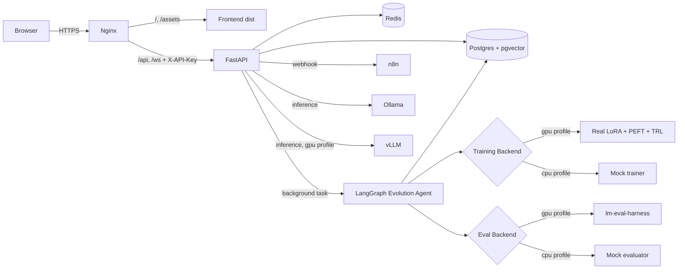

# ModelForge

**Self-Evolving LLM Platform — Autonomous Model Evolution Engine.**

ModelForge runs a closed-loop evolution agent that, generation after
generation, fine-tunes a LoRA adapter on top of a base LLM, evaluates
the candidate against a fixed benchmark suite, and either promotes it
to *champion* or discards it. The whole loop is observable through a
React dashboard and can be triggered by humans or by n8n webhooks.

| Layer       | Tech                                                         |
| ----------- | ------------------------------------------------------------ |
| Backend     | FastAPI · Pydantic v2 · asyncpg · LangGraph · Python **3.13** |
| Frontend    | React 18 · Vite 5 · Tailwind 3 · Recharts                    |
| Datastore   | Postgres 16 + pgvector · Redis 7                             |
| Inference   | Ollama (CPU) · vLLM (GPU)                                    |
| Workflow    | n8n with three pre-baked workflows                           |
| Orchestrate | Docker Compose (one file, profiles `cpu` / `gpu`)            |

---

## Quickstart — Mac dev

Prereqs: Python 3.13, Node 20, Docker Desktop.

```bash
cp .env.example .env          # then edit MODELFORGE_API_KEY + passwords
make install-dev              # creates .venv (Python 3.13)
make db-only                  # postgres + redis + n8n only
make api                      # terminal 1 — FastAPI on :8000
make frontend                 # terminal 2 — Vite on :3000
```

The API is reachable at `http://localhost:8000/docs`. The dashboard at
`http://localhost:3000` will pick up the API key from `VITE_MODELFORGE_API_KEY`
or `localStorage["modelforge_api_key"]`.

## Quickstart — DGX Spark (GPU)

```bash
cp .env.example .env          # set strong values for everything
make build                    # builds api + frontend images
docker compose --profile gpu up -d
```

This brings up the full stack including Ollama and vLLM with GPU
reservations. See [`docs/DEPLOY-DGX.md`](docs/DEPLOY-DGX.md) for the
detailed runbook (NVIDIA Container Toolkit, secrets, TLS).

---

## Architecture



Read [`docs/AGENT.md`](docs/AGENT.md) for how the LangGraph state machine
works and how to swap mock backends for real LoRA training.

---

## API surface

All `/api/*` routes require `X-API-Key`. Allowlist:

- `GET /api/system/status` — lightweight liveness for proxies.
- `GET /api/system/health` — full readiness across DB, Redis, Ollama.

Full docs: `http://localhost:8000/docs` (Swagger), `http://localhost:8000/redoc`
(ReDoc). Both are disabled when `ENVIRONMENT=production`.

---

## Tests + lint

```bash
make test                 # pytest
make lint                 # ruff + mypy
make format               # ruff format + autofix
```

CI runs the same three steps plus a Docker buildx build on every PR. On
`v*` tags it pushes images to `ghcr.io/saijayanth888/modelforge-{api,frontend}`.

---

## Security

ModelForge ships with API-key auth, hardened security headers
(`X-Content-Type-Options`, `X-Frame-Options`, `Referrer-Policy`, HSTS
when behind TLS) and a CORS guard that disables credentials whenever
`*` is present in `CORS_ORIGINS`. See [`docs/SECURITY.md`](docs/SECURITY.md)
for the threat model and rotation playbook.

---

## Repo layout

```
model-forge/
├── docker-compose.yml           # cpu (default) + gpu profiles
├── Dockerfile.api               # python:3.13-slim, non-root, healthcheck
├── Dockerfile.frontend          # nginx:1.27-alpine
├── Makefile
├── pyproject.toml               # ruff/mypy/pytest config
├── requirements.txt             # runtime deps
├── requirements-dev.txt         # + test/lint tooling
├── nginx.conf                   # security headers, /api proxy, WS upgrade
├── scripts/
│   ├── init_db.sql              # mirrors src/config/database.py schema
│   ├── start_api.sh             # local dev, with reload
│   └── test_local.py            # 8-step live smoke test
├── src/
│   ├── app.py                   # CORS guard + middleware wiring
│   ├── main.py                  # ASGI app
│   ├── agents/                  # LangGraph evolution orchestrator
│   ├── api/                     # routes + schemas + deps
│   ├── config/                  # settings, database
│   ├── middleware/              # auth, security headers, logging, errors
│   ├── services/                # lineage_db, ollama_client, model_registry
│   └── utils/                   # gpu, embeddings
├── tests/                       # pytest-asyncio
├── frontend/                    # React 18 + Vite 5 + Tailwind 3
├── n8n/workflows/               # 3 pre-baked workflows
└── docs/
    ├── AGENT.md
    ├── DEPLOY-DGX.md
    └── SECURITY.md
```

## License

MIT.
