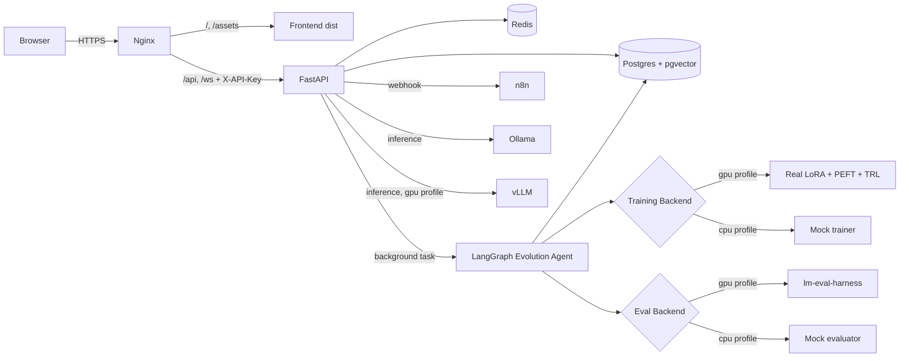

# ModelForge

**Self-Evolving LLM Platform — Autonomous Model Evolution Engine.**

ModelForge runs a closed-loop evolution agent that, generation after
generation, fine-tunes a LoRA adapter on top of a base LLM, evaluates
the candidate against a fixed benchmark suite, and either promotes it
to *champion* or discards it. The whole loop is observable through a
React dashboard and can be triggered by humans or by n8n webhooks.

| Layer       | Tech                                                         |
| ----------- | ------------------------------------------------------------ |
| Backend     | FastAPI · Pydantic v2 · asyncpg · LangGraph · Python **3.13** |
| Frontend    | React 18 · Vite 5 · Tailwind 3 · Recharts                    |
| Datastore   | Postgres 16 + pgvector · Redis 7                             |
| Inference   | Ollama (CPU) · vLLM (GPU)                                    |
| Workflow    | n8n with three pre-baked workflows                           |
| Orchestrate | Docker Compose (one file, profiles `cpu` / `gpu`)            |

---

## Quickstart — Mac dev

Prereqs: Python 3.13, Node 20, Docker Desktop.

```bash
cp .env.example .env          # MODELFORGE_API_KEY, POSTGRES_PASSWORD, N8N_ENCRYPTION_KEY, n8n basic auth
make install-dev              # creates .venv (Python 3.13) + web deps
make db-only                  # postgres + redis + n8n (n8n uses Postgres DB `n8n`)
./scripts/n8n-wait-and-login.sh   # optional: wait for /healthz + REST owner bootstrap
make api                      # terminal 1 — FastAPI on :8000
make frontend                 # terminal 2 — Vite on :3000
```

The API is reachable at `http://localhost:8000/docs` when you run the API on
the host, or at `http://localhost:8001/docs` when Docker maps the API to host
port **8001** (see `MODELFORGE_API_HOST_PORT` in `.env`). The dashboard is at
`http://localhost:3001` by default in Docker (`MODELFORGE_WEB_HOST_PORT`, avoids
clashes with a Vite dev server on **3000**). The SPA picks up the API key from
`VITE_MODELFORGE_API_KEY` or `localStorage["modelforge_api_key"]`.

## Quickstart — DGX Spark (GPU)

```bash
cp .env.example .env          # set strong values for everything
make build                    # builds api + frontend images
docker compose --profile gpu up -d
```

This brings up the full stack including Ollama and vLLM with GPU
reservations. See [`docs/DEPLOY-DGX.md`](docs/DEPLOY-DGX.md) for the
detailed runbook (NVIDIA Container Toolkit, secrets, TLS).

---

## Architecture



Read [`docs/AGENT.md`](docs/AGENT.md) for how the LangGraph state machine
works and how to swap mock backends for real LoRA training.

---

## API surface

All `/api/*` routes require `X-API-Key`. Allowlist:

- `GET /api/system/status` — lightweight liveness for proxies.
- `GET /api/system/health` — full readiness across DB, Redis, Ollama.

Full docs: `http://localhost:8000/docs` (Swagger), `http://localhost:8000/redoc`
(ReDoc). Both are disabled when `ENVIRONMENT=production`.

---

## Tests + lint

```bash
make test                 # pytest (apps/api)
make lint                 # ruff + mypy
make format               # ruff format + autofix
make test-e2e             # Playwright: starts Vite (or uses CI preview server)
```

**End-to-end against the Docker UI** (no local Vite): bring the stack up, then
from `apps/web/frontend` run:

```bash
PLAYWRIGHT_BASE_URL=http://localhost:3001 npx playwright test
```

(`MODELFORGE_WEB_HOST_PORT` may change the port; default in Compose is **3001**.)

Optional n8n health check in Playwright: `N8N_E2E=1` and `N8N_URL` (default
host port **5679** in `docker-compose.yml`). See `e2e/smoke.spec.ts`.

CI runs backend lint/tests, frontend build + Playwright smoke, and Docker
buildx on every PR. On `v*` tags it pushes images to
`ghcr.io/<owner>/modelforge-{api,frontend}`.

---

## Frontend (build, validation, design system)

**Rebuild only the web image after UI changes:**

```bash
docker compose build frontend
docker compose up -d frontend
```

**Quick validation:** `curl -fsS http://localhost:3001/healthz` should return HTTP **200**.

**Design handoff:** the Claude / ModelForge design system package (tokens,
preview HTML, UI kit snippets) lives at
[`docs/ModelForge-Design-System-handoff.zip`](docs/ModelForge-Design-System-handoff.zip).
Unzip it to read `project/colors_and_type.css` and `project/README.md`. The
running app implements the same palette and mission-control patterns in
`apps/web/frontend/src/index.css` (layout classes such as `mf-topbar`,
`mf-dashboard-canvas`, `mf-card-hover`).

**Operator notes:** the dashboard stores the API key in
`localStorage["modelforge_api_key"]` (or `VITE_MODELFORGE_API_KEY` at build
time). Same-origin `/api` is proxied by nginx in the frontend container.

**Lineage tree viewport:** the graph sits under the stats row inside the
scrollable app shell. The SVG container must inherit a real height: `Layout`
exposes `<main>` as a column flex region with `minHeight: 0`, `LineagePage`
uses `flex: 1` on the page and tree wrapper, and `LineageTree` uses
`height: 100%` (with `minHeight: 400`). Without that chain, `height: 100%` on
the SVG alone collapses and the tree looks clipped or “half page.”

---

## Documentation map

| Doc | Purpose |
| --- | ------- |
| [`docs/AGENT.md`](docs/AGENT.md) | LangGraph evolution agent |
| [`docs/DEPLOY-DGX.md`](docs/DEPLOY-DGX.md) | DGX / GPU deployment |
| [`docs/SECURITY.md`](docs/SECURITY.md) | Threat model, API key rotation |
| [`integrations/n8n/README.md`](integrations/n8n/README.md) | Workflow imports, env vars, production checklist |
| [`docs/ModelForge-Design-System-handoff.zip`](docs/ModelForge-Design-System-handoff.zip) | UI tokens, typography, component previews |

---

## Changelog (development log)

Entries are high-level; use `git log` for full history.

| Date (UTC) | Summary |
| ---------- | ------- |
| **2026-05-03** | Frontend Docker image rebuilt (`modelforge-frontend:latest`). Container health: `GET /healthz` → **200**. Playwright against `http://localhost:3001`: **7 passed**, **1 skipped** (optional n8n test). Design system handoff archived under `docs/`. n8n: default public webhook base aligned to host port **5679**; see `integrations/n8n/README.md`. **Lineage:** flex height chain from `Layout.jsx` → `LineagePage.jsx` → `LineageTree.jsx` so the SVG fills the panel (fixes collapsed/clipped tree). |

---

## Security

ModelForge ships with API-key auth, hardened security headers
(`X-Content-Type-Options`, `X-Frame-Options`, `Referrer-Policy`, HSTS
when behind TLS) and a CORS guard that disables credentials whenever
`*` is present in `CORS_ORIGINS`. See [`docs/SECURITY.md`](docs/SECURITY.md)
for the threat model and rotation playbook.

---

## Repo layout

```
model-forge/
├── docker-compose.yml           # cpu (default) + gpu profiles; n8n → Postgres
├── infra/
│   └── nginx.conf               # security headers, /api proxy, WS upgrade
├── apps/
│   ├── api/                     # FastAPI (Python 3.13)
│   │   ├── Dockerfile           # build context: repo root
│   │   ├── pyproject.toml       # ruff / mypy / pytest
│   │   ├── requirements*.txt
│   │   ├── src/                 # main.py, agents/, api/, …
│   │   └── tests/
│   └── web/
│       ├── Dockerfile           # Vite build → nginx (context: repo root)
│       └── frontend/            # React 18 + Vite 5 + Tailwind 3 + Playwright
│           ├── e2e/             # smoke + UI navigation specs
│           └── playwright.config.ts
├── integrations/
│   └── n8n/
│       ├── README.md
│       └── workflows/           # JSON exports for import
├── scripts/
│   ├── postgres-init/           # modelforge + n8n DB bootstrap
│   ├── n8n_bootstrap_owner.py   # REST owner signup (with basic auth)
│   ├── n8n-wait-and-login.sh
│   ├── start_api.sh
│   └── test_local.py
├── Makefile
└── docs/
    ├── AGENT.md
    ├── DEPLOY-DGX.md
    ├── SECURITY.md
    ├── ModelForge-Design-System-handoff.zip   # UI tokens + previews (unzip locally)
    └── superpowers/specs/                     # design / architecture notes
```

## License

MIT.
