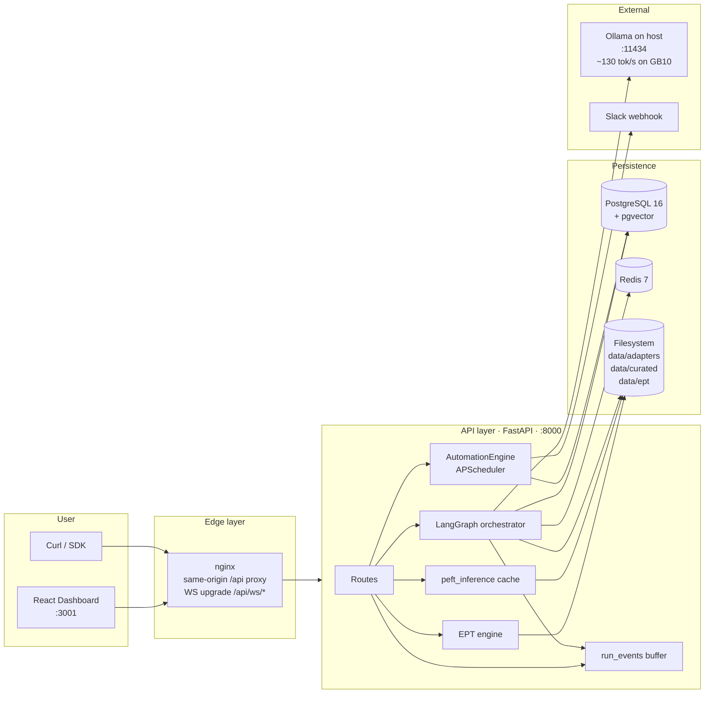
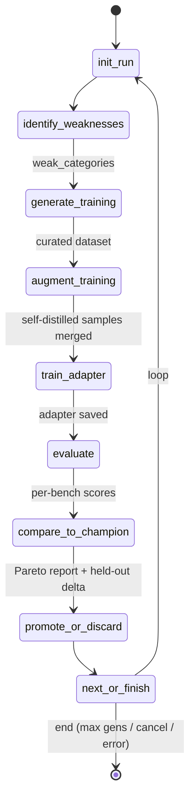
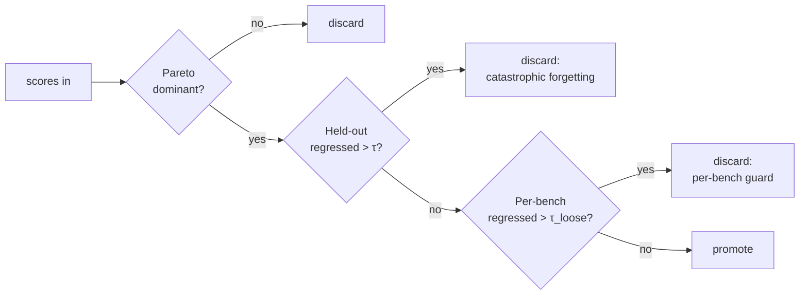
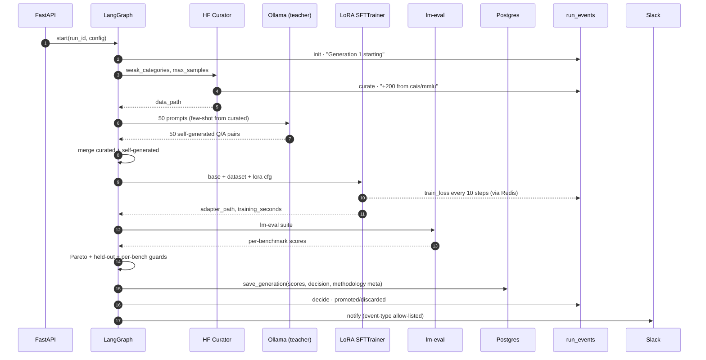
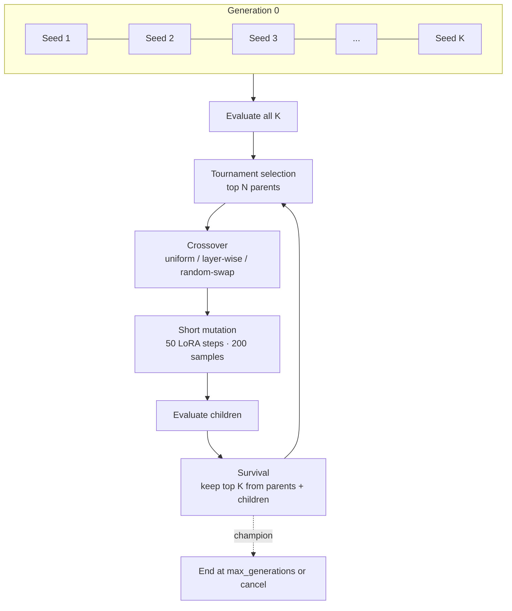
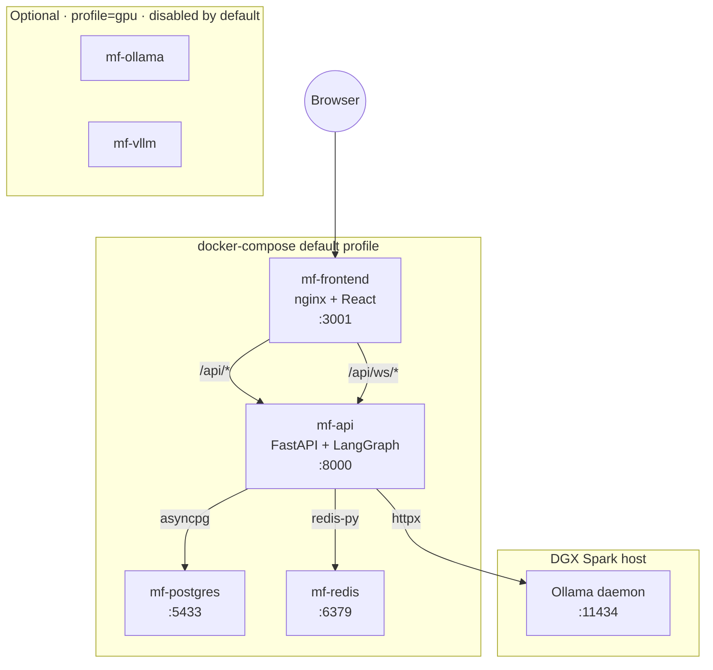
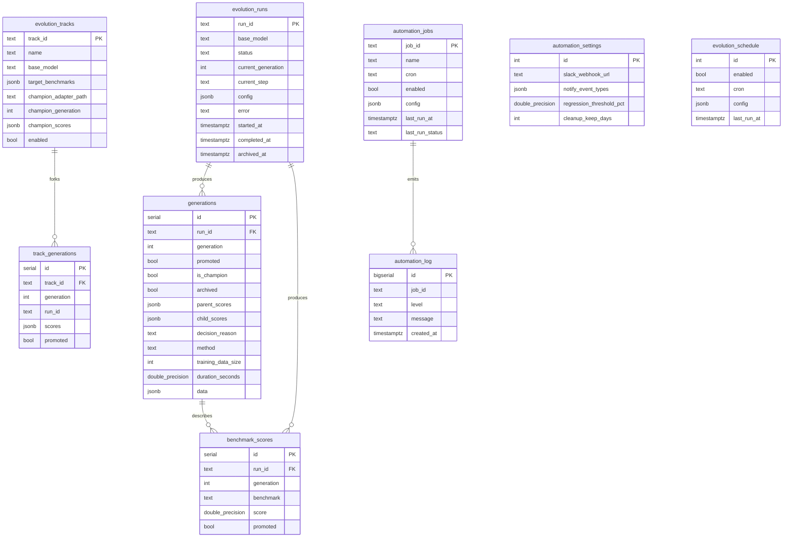

<div align="center">

# ModelForge

**An autonomous evolution platform for LoRA adapters.**

A closed-loop system that fine-tunes, evaluates, and selects model
adapters generation after generation — with multi-objective Pareto
selection, self-distilled training data, population-based evolution,
and a real-time dashboard.

[](#)
[](#)
[](#)
[](#)
[](#)
[-76B900.svg)](#)

</div>

---

## Table of contents

- [What it is](#what-it-is)
- [Why it exists](#why-it-exists)
- [Capabilities at a glance](#capabilities-at-a-glance)
- [System architecture](#system-architecture)
- [Evolution graph](#evolution-graph)
- [Population evolution (EPT)](#population-evolution-ept)
- [Deployment topology](#deployment-topology)
- [Data model](#data-model)
- [Quick start](#quick-start)
- [Configuration reference](#configuration-reference)
- [API surface](#api-surface)
- [Frontend surface](#frontend-surface)
- [Repository layout](#repository-layout)
- [Operational concerns](#operational-concerns)
- [Roadmap](#roadmap)
- [Acknowledgements](#acknowledgements)
- [License](#license)

---

## What it is

ModelForge is a self-contained platform for **autonomous LoRA adapter
evolution**. Given a base model and a benchmark suite, it runs a closed
loop that:

1. Identifies which benchmarks the current champion is weakest on.
2. Curates a training dataset targeting those benchmarks (HuggingFace +
   self-distillation via a teacher LLM).
3. Trains a LoRA adapter on top of the base.
4. Evaluates the candidate via `lm-eval-harness`.
5. Promotes or discards the candidate using **Pareto-dominant selection**
   with held-out catastrophic-forgetting guards.
6. Persists every decision to the lineage database with full provenance.
7. Repeats — for N generations, with optional **population-based
   evolution** that breeds adapter weights via crossover.

Everything is observable in real time through a React dashboard.
Scheduling, drift detection, Slack notifications, daily/weekly reports,
and auto-cleanup all run in-process — no external orchestrator.

## Why it exists

**Goal.** Push a single base model further than one-shot fine-tuning by
running an evolutionary loop that respects the multi-objective nature of
LLM benchmarks: a child that gains 5% on MMLU but loses 10% on GSM8K is
a *bad* trade, even when the average improves.

**Design constraints.**
- Run on consumer-class hardware (NVIDIA DGX Spark, GB10, 128GB unified
  memory).
- Be honest about what the model is doing — every promotion decision is
  inspectable, every adapter is reproducible from a single record.
- One `docker compose up` to bring up the whole stack.

**Honest scoping.** Weight-space LoRA merging itself isn't novel research
(see TIES, DARE, Model Soups, LoRA Hub). The contribution here is
packaging crossover + tournament + mutation + lineage tracking inside an
autonomous loop with a real UI, on a single-GPU consumer host, with full
methodology metadata persisted for paper-grade reproducibility.

---

## Capabilities at a glance

| Capability | Where it lives | Notes |
|---|---|---|
| Single-generation evolution loop (`init → identify → curate → augment → train → eval → compare → decide`) | `apps/api/src/agents/evolution_graph.py` | LangGraph state machine, 8 nodes, lazy step emit |
| Self-distilled training data | `evolution_graph.augment_training` | Teacher LLM via Ollama generates N new Q/A pairs from random curated seeds |
| Pareto-dominant selection | `services/pareto_selector.py` | Promote ⇔ better on ≥1 bench AND no bench regressed > τ |
| Held-out catastrophic-forgetting guard | `evolution_graph.compare_to_champion` | Tracks trained vs held-out delta separately |
| Population evolution (EPT) | `apps/api/src/agents/ept/` | Crossover + mutation + tournament + lineage; 3 strategies (uniform, layer-wise, random-swap) |
| Honest base-vs-champion inference | `services/peft_inference.py` | LRU-cached base, attaches PEFT for the champion side; replaces the deceptive Ollama-tag fallback |
| Live phase event feed | `services/run_events.py` + `EventsFeed.jsx` | In-process ring buffer; `since=` cursor; UI polls every 2s |
| Built-in automation engine | `services/automation.py` | APScheduler in-process; replaces n8n; six default jobs (evolution, drift, health, daily, weekly, cleanup) |
| Slack notifications | `services/automation.AutomationEngine` | Per-event-type allow-list; URL stored in DB, masked in API responses |
| Paper-ready exports | `api/routes/exports.py` | Score curves (PNG/SVG), lineage tree (PNG/SVG), LaTeX ablation table, full JSON dump |
| Ablation studies | `services/ablation_presets.py` + `routes/experiments.py` | 4 hardcoded ablations (lr, rank, data-source, specialist-vs-generalist), sequential queue |
| Dashboard | `apps/web/frontend/` | 9 pages: Dashboard, Adapters, Lineage, Datasets, Benchmarks, Playground, Population (EPT), Automation, Settings |
| Run history database | `evolution_runs`, `generations`, `benchmark_scores` | Soft-delete via `archived_at`; full config + scores per gen |

---

## System architecture



### Component responsibilities

| Component | Responsibility |
|---|---|
| **FastAPI app** | HTTP + WebSocket surface; bootstraps engines on lifespan |
| **LangGraph orchestrator** | One generation per pass: `init → identify → curate → augment → train → eval → compare → decide` |
| **EPT engine** | Population-based variant: maintains K adapters, breeds via crossover, mutates, runs tournament selection |
| **AutomationEngine** | In-process scheduler (APScheduler); 6 default jobs; Slack delivery; per-event-type allow-list |
| **run_events buffer** | Per-run, in-memory ring buffer (200 events/run); `since=` cursor for incremental polling |
| **peft_inference** | LRU-cached base model on the API GPU; attaches PEFT adapter for honest A/B comparison |
| **Postgres** | Source of truth for runs, generations, benchmark scores, automation state, EPT tracks |
| **Redis** | Training callback channel (`training:<run_id>`) for live loss streaming via WebSocket |
| **Filesystem** | Adapter weights (`data/adapters/<run>/gen-<N>`), curated datasets (`data/curated/gen-<N>`), EPT runs (`data/ept/<run>/`) |
| **Ollama (host)** | Inference for Playground + ForgeAgent + EPT teacher (self-distillation) |

### Stack

| Layer | Technology |
|---|---|
| Backend | FastAPI · Pydantic v2 · asyncpg · LangGraph · APScheduler · Python 3.13 |
| ML stack | PyTorch ≥ 2.10 · transformers ≥ 5.7 · peft ≥ 0.19 · trl ≥ 1.3 · lm-eval ≥ 0.4.11 |
| Frontend | React 18 · Vite 5 · Recharts · react-markdown · Tailwind |
| Storage | PostgreSQL 16 (+ pgvector) · Redis 7 · local filesystem volumes |
| Inference | Ollama (host preferred) · in-process PEFT · optional vLLM |
| Deployment | Docker Compose (single file, profiles for GPU services) |

---

## Evolution graph

Every generation runs through this state machine. The orchestrator is
defined in `apps/api/src/agents/evolution_graph.py`:



### Decision rule

Composite — three layered guards must agree to promote:



| Guard | Default threshold | Override env |
|---|---|---|
| Pareto dominance | 0.01 (1%) | `MODELFORGE_PARETO_THRESHOLD` |
| Held-out catastrophic | 0.03 (3%) | `MODELFORGE_REGRESSION_THRESHOLD` |
| Per-bench regression | 0.03 (3%) | `MODELFORGE_REGRESSION_THRESHOLD` |

### Data flow during one generation



### Methodology metadata persisted per generation

Every `generations.data` JSONB carries the full reproducibility envelope:

| Field | Source |
|---|---|
| `curated_sample_count` | curator |
| `self_generated_count` | augment_training |
| `trained_benchmarks` | curator (= `weak_categories`) |
| `held_out_benchmarks` | derived (all 5 − trained) |
| `trained_benchmark_delta` | compare_to_champion |
| `held_out_benchmark_delta` | compare_to_champion |
| `pareto_report` | pareto_selector |
| `regression_report` | regression_detector |
| `training_seconds`, `eval_seconds` | runner |
| `base_model_hf_id` | hf_model_id resolver |
| `config` | full run config (lora_rank, alpha, lr, batch_size, max_samples, base_model) |

---

## Population evolution (EPT)

Population-based variant for harder problems. K adapters live
simultaneously; selection + crossover + mutation drive the loop.



### Crossover operator

The pure operator is `apps/api/src/agents/ept/crossover.py`:

```python
crossover(parent_a_path, parent_b_path, output_dir,
          alpha=0.5, strategy="uniform"|"layer_wise"|"random_swap",
          seed=None) -> child_path
```

Each call produces a child adapter directory containing
`adapter_model.safetensors` + `adapter_config.json` +
`crossover_metadata.json` (full provenance: parent paths, alpha,
strategy, seed). 8 unit tests in `apps/api/tests/test_crossover.py`.

### Mutation correctness

EPT mutation **continues training the existing LoRA matrices in-place**
(`PeftModel.from_pretrained(..., is_trainable=True)`), so crossover
weights actually propagate generation-to-generation. An earlier
implementation that did `merge_and_unload()` then trained a fresh
adapter was caught and fixed in code review.

### EPT page

`/ept` shows the live population grid (cards with score bars), a
mini-tree of parent → child edges, an evolution chart, and a crossover
inspector that flags rows where a child beats *both* parents
("★ emergent capability") — the signal worth writing about.

---

## Deployment topology



**Host Ollama vs Docker Ollama.** On the GB10 chip, host-side `ollama
serve` (systemd) hits ~130 tok/s; the same model in a container drops
to ~0.47 tok/s due to GPU passthrough overhead with unified memory.
Default is host. The `mf-ollama` and `mf-vllm` blocks are commented out
in `docker-compose.yml` with one-line re-enable instructions.

---

## Data model

Postgres schema after all migrations (idempotent on every API boot via
`LineageDB.apply_phase34_migrations`):



### Filesystem layout

```
data/
├── adapters/<run_id>/gen-<N>/        # PEFT-format adapter
│   ├── adapter_model.safetensors
│   ├── adapter_config.json
│   ├── tokenizer.*
│   └── ept_mutation.json             # only on EPT-mutated members
├── curated/gen-<N>/                  # HuggingFace `Dataset.save_to_disk`
│   ├── data-*.arrow
│   ├── dataset_info.json
│   └── mf_meta.json                  # categories, sources, num_samples
├── ept/<run_id>/
│   ├── adapters/<member_id>/         # one dir per population member
│   ├── crossover/child-<id>/         # raw crossover output (pre-mutation)
│   ├── history.json                  # per-generation snapshots
│   └── population.json               # current full population
├── registry.json                     # file-backed champion registry
└── .cache/huggingface/               # HF model + dataset caches
```

---

## Quick start

### Prerequisites

| Need | Version |
|---|---|
| Docker + Compose v2 | latest |
| GPU host (for real training) | NVIDIA Blackwell / Ampere / Ada / Hopper, ≥ 24 GB |
| Ollama (host) | latest, listening on `:11434` |
| Disk | ~20 GB for the HF model cache + adapter outputs |

### Bring it up

```bash
git clone https://github.com/saijayanth888/project-Doze.git modelforge
cd modelforge
cp .env.example .env
# edit .env — set MODELFORGE_API_KEY, POSTGRES_PASSWORD, optional SLACK_WEBHOOK_URL

# ensure host ollama is running:
ollama serve &        # or via systemd
ollama pull llama3.2:3b

docker compose up -d --build
```

| Service | URL |
|---|---|
| Dashboard | http://localhost:3001 |
| API docs (Swagger) | http://localhost:8000/docs |
| API health | http://localhost:8000/api/system/health |

### Run your first evolution

```bash
K=$(grep '^MODELFORGE_API_KEY=' .env | cut -d= -f2)

curl -X POST -H "X-API-Key: $K" -H "Content-Type: application/json" \
  http://localhost:8000/api/evolve/start \
  -d '{
    "base_model":     "meta-llama/Llama-3.2-3B-Instruct",
    "max_generations": 3,
    "max_samples":     1000,
    "lora_rank":       16,
    "batch_size":      2
  }'
```

Open `/dashboard` to watch it. The Activity feed and Live Events panel
both poll the in-process event bus every 2s — you'll see curate /
train / eval / decide events land in real time.

### Run an EPT smoke test

Cheap on a single GPU: TinyLlama, population 4, 2 generations.

```bash
curl -X POST -H "X-API-Key: $K" -H "Content-Type: application/json" \
  http://localhost:8000/api/ept/start \
  -d '{
    "population_size":   4,
    "max_generations":   2,
    "base_model":        "TinyLlama/TinyLlama-1.1B-Chat-v1.0",
    "target_benchmarks": ["arc_challenge", "hellaswag"],
    "eval_benchmarks":   ["arc_challenge", "hellaswag", "mmlu"],
    "mutation_steps":    30,
    "mutation_samples":  100
  }'
```

Open `/ept` to watch the population grid, lineage tree, and crossover
inspector.

---

## Configuration reference

All `.env` and runtime knobs that meaningfully change behaviour:

### API + storage

| Var | Default | Purpose |
|---|---|---|
| `MODELFORGE_API_KEY` | *required* | Single API key; passed in `X-API-Key` |
| `POSTGRES_PASSWORD` | *required* | Postgres root password |
| `MODELFORGE_API_HOST_PORT` | `8000` | Override host port for the API |
| `MODELFORGE_WEB_HOST_PORT` | `3001` | Override host port for the dashboard |
| `OLLAMA_HOST` | `http://host.docker.internal:11434` | OPTION A (host Ollama). Set to `http://ollama:11434` for OPTION B (Docker Ollama) |
| `HF_HOME` etc. | `/app/data/.cache/huggingface` | HF cache directory inside the api container |
| `PYTORCH_CUDA_ALLOC_CONF` | `expandable_segments:True` | Avoids fragmentation OOM after a failed run |

### Evolution behaviour

| Var | Default | Purpose |
|---|---|---|
| `MODELFORGE_PARETO_THRESHOLD` | `0.01` | Per-bench drop allowed during Pareto check |
| `MODELFORGE_REGRESSION_THRESHOLD` | `0.03` | Per-bench + held-out catastrophic-forgetting threshold |
| `MODELFORGE_SELF_GEN_TEACHER` | `llama3.2:3b` | Ollama tag for the self-distillation teacher |
| `MODELFORGE_SELF_GEN_SEEDS` | `50` | Number of self-generated samples per generation; `0` disables |

### Automation

The Slack webhook URL and per-event-type allow-list are stored in the
`automation_settings` table and editable from `/automation` in the
dashboard. The `SLACK_WEBHOOK_URL` env is used as a boot-time fallback
only.

---

## API surface

The full surface is in `http://localhost:8000/docs`. Highlights by tag:

### Evolution

| Endpoint | Purpose |
|---|---|
| `POST /api/evolve/start` | Kick off a run |
| `GET /api/evolve/status` | Poll the active run |
| `POST /api/evolve/{run_id}/stop` | Cooperative cancel |
| `GET /api/evolve/{run_id}/events` | Phase event timeline (uses `since=` cursor) |

### Lineage + adapters

| Endpoint | Purpose |
|---|---|
| `GET /api/lineage/tree` | Promoted lineage tree (with synthetic Gen 0 base node) |
| `GET /api/lineage/generations` | Flat list of every generation row |
| `GET /api/lineage/activity` | DB-backed activity feed |
| `GET /api/adapters/` | All adapters with scores, training config, weights flag |
| `POST /api/adapters/{id}/serve` | Make this the served champion (refuses empty stubs) |
| `POST /api/adapters/{id}/rollback` | Promote any adapter to champion |
| `GET /api/adapters/compare/{a}/{b}` | Same-prompt inference on both |
| `POST /api/adapters/cleanup` | Delete archived adapters older than N days |

### Inference

| Endpoint | Purpose |
|---|---|
| `POST /api/infer/` | Plain Ollama call |
| `POST /api/infer/compare` | Two Ollama tags (base vs champion) |
| `POST /api/infer/adapter/compare` | **Honest** PEFT comparison — base model + adapter loaded on the API GPU |

### Population (EPT)

| Endpoint | Purpose |
|---|---|
| `POST /api/ept/start` | Start a population evolution run |
| `GET /api/ept/status` | Active runner state |
| `GET /api/ept/population` | Members + parent links + scores |
| `GET /api/ept/history` | Per-generation snapshots |
| `GET /api/ept/lineage/{member_id}` | Ancestry trace |
| `GET /api/ept/events` | In-memory event log |
| `POST /api/ept/stop` | Cooperative cancel |

### Experiments + paper exports

| Endpoint | Purpose |
|---|---|
| `GET /api/experiments` | Joined view of every (run, generation) record |
| `GET /api/experiments/export` | CSV download |
| `GET /api/experiments/ablations` | Predefined ablation studies |
| `POST /api/experiments/ablation` | Run an ablation sequentially |
| `GET /api/export/evolution-curves?format=png\|svg` | Score-trend chart figure |
| `GET /api/export/lineage-tree?format=svg\|png` | Lineage tree figure |
| `GET /api/export/ablation-table` | LaTeX (booktabs) table |
| `GET /api/export/experiment-data` | Complete JSON dump |

### Automation

| Endpoint | Purpose |
|---|---|
| `GET /api/automation/jobs` | All scheduled jobs with last-run state |
| `PUT /api/automation/jobs/{id}` | Enable/disable, retime, reconfigure |
| `POST /api/automation/jobs/{id}/trigger` | Run now |
| `GET /api/automation/log` | Append-only event stream |
| `GET /api/automation/settings` | Slack URL (masked) + event allow-list + thresholds |
| `POST /api/automation/slack/test` | Send a test notification |

### Datasets + benchmarks + system

| Endpoint | Purpose |
|---|---|
| `GET /api/datasets/` | List curated + custom |
| `GET /api/datasets/{id}` | Sample preview (Arrow shard or JSONL) |
| `POST /api/datasets/upload` | Upload a custom JSONL |
| `GET /api/eval/scores` | Trend rows for the dashboard chart |
| `GET /api/system/health` | Postgres + Redis + Ollama liveness |
| `GET /api/system/gpu` | nvidia-smi output + unified-memory enrichment for GB10 |

---

## Frontend surface

| Route | Page | Highlights |
|---|---|---|
| `/dashboard` | Operator overview | Evolution status + animated step indicator + Score Trends with Pareto annotations + Activity feed (DB-backed) + Live Events (in-process) |
| `/adapters` | Adapter management | Master/detail with persistent panel · per-bench mini-bars · Compare workspace (radar + delta strip + same-prompt inference) |
| `/lineage` | Tree viewer | Synthetic Gen-0 base node · always-visible detail pane · per-generation timeline cards with Playground / Compare / Report actions |
| `/playground` | Inference UI | react-markdown rendering · syntax-highlighted code · per-pane copy + metadata (`tok/s · latency · model · source`) · honest PEFT path |
| `/datasets` | Curated + uploaded | Live polling · category pills · sample preview (loads from Arrow shard) · upload validation |
| `/benchmarks` | Score trends | Per-benchmark hero cards + per-generation table |
| `/ept` | Population evolution | Control panel · population grid · lineage SVG · evolution chart · crossover inspector with "★ emergent" tagging |
| `/automation` | Schedules + Slack + guards | Jobs grid · Slack panel (URL save + test + event allow-list) · Guards (regression / cleanup / memory) · live execution log |
| `/settings` | Connection management | Test Connections grid (api/postgres/redis/ollama/n8n/gpu) · API key field · model defaults |

---

## Repository layout

```
modelforge/
├── apps/
│   ├── api/                          # FastAPI service
│   │   ├── Dockerfile
│   │   ├── requirements.txt
│   │   ├── src/
│   │   │   ├── app.py                # lifespan + automation engine boot
│   │   │   ├── api/
│   │   │   │   ├── router.py         # mounts every prefix
│   │   │   │   ├── routes/           # one file per resource
│   │   │   │   │   ├── adapters.py
│   │   │   │   │   ├── automation.py
│   │   │   │   │   ├── ept.py
│   │   │   │   │   ├── evolution.py
│   │   │   │   │   ├── experiments.py
│   │   │   │   │   ├── exports.py
│   │   │   │   │   └── …
│   │   │   │   └── schemas/
│   │   │   ├── agents/
│   │   │   │   ├── evolution_graph.py # LangGraph state machine
│   │   │   │   ├── runner.py         # task lifecycle + Slack hookup
│   │   │   │   ├── training_backend.py
│   │   │   │   ├── eval_backend.py
│   │   │   │   └── ept/              # population evolution package
│   │   │   │       ├── crossover.py
│   │   │   │       ├── mutation.py
│   │   │   │       ├── population.py
│   │   │   │       └── runner.py
│   │   │   ├── services/
│   │   │   │   ├── automation.py     # APScheduler · Slack · jobs
│   │   │   │   ├── pareto_selector.py
│   │   │   │   ├── regression_detector.py
│   │   │   │   ├── peft_inference.py
│   │   │   │   ├── run_events.py
│   │   │   │   ├── data_curator.py
│   │   │   │   ├── lineage_db.py     # all DAOs (incl. migrations)
│   │   │   │   ├── experiment_tracker.py
│   │   │   │   ├── ablation_presets.py
│   │   │   │   └── model_registry.py
│   │   │   └── utils/
│   │   │       ├── hf_model_id.py    # Ollama tag → HF id resolver
│   │   │       └── gpu.py
│   │   └── tests/
│   │       └── test_crossover.py
│   └── web/
│       ├── Dockerfile
│       └── frontend/
│           └── src/
│               ├── App.jsx
│               ├── pages/            # 9 pages, see frontend table
│               ├── components/
│               │   ├── dashboard/    # EvolutionStatus, ScoreTrends, EventsFeed, ActivityFeed, LatestGeneration, ChampionCard, GPUMonitor
│               │   ├── lineage/
│               │   ├── playground/   # InferencePane (markdown)
│               │   └── layout/       # Sidebar, TopBar
│               └── config/
├── docker-compose.yml                # postgres · redis · api · frontend (n8n/ollama/vllm commented)
├── infra/nginx.conf                  # /api/* + /api/ws/* upgrade
├── scripts/postgres-init/
│   ├── 01-modelforge.sql
│   ├── 02-n8n-database.sql
│   └── 03-phase3-phase4.sql          # tracks · schedule · automation tables
├── integrations/n8n/workflows/       # legacy reference workflows (n8n disabled)
└── README.md
```

---

## Operational concerns

### Backups + portability

The platform's state is in three places:
1. `data/` directory (adapters, curated shards, EPT outputs, registry).
2. Postgres volume (`postgres_data` in compose).
3. Redis volume (transient — fine to drop).

Snapshot the first two and you can move the install to another host
verbatim.

### What survives an API restart

| Yes (durable) | No (in-memory) |
|---|---|
| `evolution_runs`, `generations`, `benchmark_scores` rows | Active LangGraph task |
| Adapter weights on disk | `run_events` ring buffer |
| Automation job config in `automation_jobs` | EPT runner instance |
| Slack settings | PEFT model cache |
| EPT `history.json` / `population.json` snapshots | |

If a long run is in flight, **do not** rebuild/restart the API container
mid-run. The runner task lives in the API process — it will die. The DB
will say `running` until the API restarts and reconciles.

### Single-GPU constraints

ModelForge serializes training and evaluation. Population evolution
gives you diversity (richer crossover material) — not parallel
throughput. An EPT run with `population_size=8, mutation_steps=50` is
~8× one normal training run. Plan accordingly.

### Cost estimates (DGX Spark, GB10, 128 GB)

| Workload | Wall time |
|---|---|
| TinyLlama 1.1B · 1 gen · 1000 samples · LoRA r=16 | ~2 min train + ~75 min eval |
| Llama 3.2 3B · 1 gen · 1000 samples · LoRA r=16 | ~3 min train + ~3 hr eval |
| Llama 3.2 3B · 3 gen evolution | ~9–10 hours total |
| Llama 3.2 3B · EPT pop 8 · 2 gens | ~24 hours (16 evaluations) |

Most of the time goes into `lm-eval-harness` running ~56k loglikelihood
requests across the five-benchmark suite. Reducing the benchmark list
shortens the loop linearly.

---

## Roadmap

Done (live in `main`):
- ✅ LangGraph evolution loop · self-distillation · Pareto + held-out guards
- ✅ EPT package (crossover · mutation · tournament · UI)
- ✅ Honest PEFT inference path
- ✅ AutomationEngine (replaces n8n)
- ✅ Paper-export endpoints (PNG/SVG/LaTeX/JSON)
- ✅ Live event feed + adaptive polling
- ✅ Adapters / Lineage / Datasets pages — full master-detail UX

In flight or pending:
- 🔄 Phase-2 evidence run — `meta-llama/Llama-3.2-3B-Instruct × 3 gens` (in progress).
- ⬜ ForgeAgent — track DAO is shipped, classifier-routed query surface (`/api/forge/query`) and dedicated page deferred.
- ⬜ Run-history page (`/history`) — DAO is shipped, route file + UI not yet wired.
- ⬜ `/api/schedule` route (DAO ready).
- ⬜ `/api/system/storage` and `/cleanup` routes (logic in `automation._auto_cleanup`).
- ⬜ Reproducible benchmark report (after Phase-2 lands).

---

## Acknowledgements

Building blocks this project leans on:

- **HuggingFace** — `transformers`, `peft`, `trl`, `datasets`, the model
  hub, and the `lm-evaluation-harness`.
- **LangGraph** — composable async state machines for the evolution
  orchestrator.
- **NVIDIA** — DGX Spark / GB10 hardware that made the unified-memory
  experiments practical.
- **Model-merging research** — TIES, DARE, Model Soups, LoRA Hub —
  prior work this platform composes into a complete loop.
- **Ollama** — drop-in local inference daemon used throughout.
- **APScheduler** — in-process cron without an external orchestrator.

## License

MIT — see [`LICENSE`](LICENSE).
