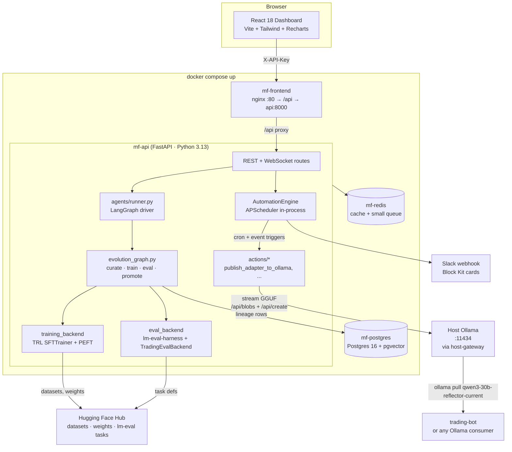

<div align="center">

# ModelForge — Autonomous LoRA Evolution

**Per-track LoRA training, Pareto multi-objective promotion, in-process AutomationEngine, real-time dashboard.**

**Built for NVIDIA DGX Spark. Self-contained. MIT-licensed.**

[](#)
[](#)
[](#)
[](LICENSE)
[](#)
[-76B900.svg)](#)

</div>

---

## Why this exists

Per-task LLM fine-tuning has too many moving parts: data curation, training,
evaluation, lineage tracking, promotion decisions, and finally *serving* the
result somewhere a real application can call it. Existing tools each solve
one slice — experiment trackers track, AutoML platforms train, hyperparameter
search frameworks search — but the operator is left to glue them into a
closed loop. ModelForge does the loop in one repository, in one process, on
one machine. Curate → train → eval → Pareto-promote → publish to Ollama → record
in the lineage DB. MIT-licensed. `docker compose up`.

It is built for, and tested on, an NVIDIA DGX Spark (GB10, 128 GB unified
memory). It is the sibling project to [trading-bot](../trading-bot) and turns
that bot's daily reflections into stronger specialised adapters every Sunday at
04:00 ET — but ModelForge generalises to any LLM specialisation task with a
benchmark suite.

---

## Table of contents

- [What is actually working today](#what-is-actually-working-today)
- [Architecture](#architecture)
- [What makes this different](#what-makes-this-different)
- [Quickstart](#quickstart)
- [The 6 trading-* eval modules (for sibling-repo users)](#the-6-trading-eval-modules-for-sibling-repo-users)
- [Tech stack](#tech-stack)
- [The 9 system workflows (automations)](#the-9-system-workflows-automations)
- [File layout](#file-layout)
- [Roadmap](#roadmap)
- [Acknowledgements](#acknowledgements)
- [License](#license)

---

## What is actually working today

- **Per-track evolution loop** — data curation → LoRA training (TRL `SFTTrainer`
  + PEFT) → eval (lm-eval-harness or custom callable) → Pareto promotion →
  lineage persistence. Driven by a LangGraph state machine; every node
  awaits `on_state_change` so progress streams to Postgres for the
  WebSocket subscribers.
- **4 default tracks** seeded on first boot (`reasoning`, `code`, `math`,
  `general` — see `services/track_seed.py`). Trading-bot integrates by adding
  its own track rows via the API; the 6 trading-* **eval scorers** ship in
  `agents/evals/` and dispatch through `eval_registry.EVAL_REGISTRY`.
- **AutomationEngine** — APScheduler-backed, in-process, replaces n8n. 9
  seeded system workflows (cron + event triggers, see below). Workflow
  action shapes are validated on POST/PUT to the API so a typo'd `kind`
  fails at form-submit, not at fire-time.
- **`adapter.publish_ollama`** — streams the GGUF (8 MiB chunks) to host
  Ollama via `/api/blobs` + `/api/create`, then swings a `-current` alias
  via `/api/copy`. Handles 5–15 GB blobs without OOM on the unified-memory
  Spark.
- **React 18 dashboard** (Vite + Tailwind + Recharts + lucide-react) with
  workflow editor, lineage browser, adapters page, campaign view, playground.
- **Postgres 16 + pgvector** lineage DB. 17 hand-built indices (6 added in
  the 2026-05-12 hardening pass) cover the dashboard's hot query paths.
- **HTTP-only boundary** — no shared filesystem, no shared DB with consumers.
  The trading-bot pulls from Ollama by tag (`qwen3:30b-reflector-current`);
  the only ModelForge dependency at runtime is the Ollama HTTP surface.
- **Tests**: `141 passed, 1 skipped` (on the staged hardening branch). The
  one skip is explicit, with a `pytest.mark.skip(reason=...)` pointing to
  the audit. Runnable as `pytest apps/api/tests/ -v`.

---

## Architecture

### The 4-stage evolution loop

```
┌─────────────────────────────────────────────────────────────────────┐
│                                                                     │
│   ┌──────────┐    ┌────────────┐    ┌──────────┐    ┌────────────┐  │
│   │ curate   │ ─▶ │  train     │ ─▶ │  eval    │ ─▶ │  promote   │  │
│   │ (HF /    │    │ (TRL SFT   │    │ (lm-eval │    │  (Pareto + │  │
│   │  self-   │    │  + PEFT    │    │  or per- │    │  per-bench │  │
│   │  distil) │    │  LoRA)     │    │  track   │    │  regression│  │
│   │          │    │            │    │  scorer) │    │  guard)    │  │
│   └──────────┘    └────────────┘    └──────────┘    └─────┬──────┘  │
│                                                            │         │
│         ┌──────────────────────────────────────────────────┘         │
│         ▼                                                            │
│   ┌────────────┐    ┌──────────────┐    ┌──────────────────────┐    │
│   │  lineage   │ ─▶ │  publish to  │ ─▶ │  Ollama tag created   │    │
│   │  DB        │    │  Ollama      │    │  qwen3-30b-           │    │
│   │  (track    │    │  (streamed   │    │  reflector-current    │    │
│   │  champion  │    │  GGUF over   │    │  → trading-bot reads  │    │
│   │  updated)  │    │  /api/blobs) │    │  by tag, no code      │    │
│   │            │    │              │    │  changes              │    │
│   └────────────┘    └──────────────┘    └──────────────────────┘    │
│                                                                     │
└─────────────────────────────────────────────────────────────────────┘
```

Each arrow is one node in `agents/evolution_graph.py`. The promotion step
is gated by **Pareto dominance** over the previous champion plus a
per-bench regression guard so a child that gains 5% on MMLU but loses 10%
on GSM8K is rejected even though its average is higher.

### Stack topology



---

## What makes this different

| Tool                          | What it does well                                       | Where ModelForge fills the gap                           |
| ----------------------------- | ------------------------------------------------------- | -------------------------------------------------------- |
| **Weights & Biases / MLflow** | Experiment tracking, dashboards, model registry         | The whole train → eval → Pareto-promote → serve loop is not in either tool; you write it yourself. ModelForge ships it. |
| **Hugging Face AutoTrain**    | Hosted single-task fine-tuning on HF infra              | Cloud-only, one task at a time, no multi-objective Pareto gate, no auto-publish to a local inference server. ModelForge runs locally, multi-track, with a per-bench regression guard. |
| **Vertex AI Vizier / Optuna** | Bayesian + bandit hyperparameter optimisation           | Different problem — they tune hyperparameters, ModelForge tunes the *adapter*. ModelForge can be driven by either as the search backend. |
| **Self-rewarding-LM papers**  | Research on iterative self-improvement (incl. CAI)      | They publish methodology and weights. ModelForge is the platform you'd build *to run* one of those papers end-to-end, with lineage and a UI. |

The point of comparison isn't "ModelForge is better than W&B". It's that
ModelForge is the missing **loop closure**: it assumes you already have an
experiment tracker (or it'll be its own), already have a benchmark suite (or
you bring `lm-eval-harness`), and turns those into a continuous training
process that ships adapters to production every time the Pareto front moves.

---

## Quickstart

Requires Docker, Docker Compose, and an Ollama daemon (either on the host or
via the `gpu` compose profile).

```bash
git clone https://github.com/<owner>/model-forge
cd model-forge
cp .env.example .env
$EDITOR .env   # generate MODELFORGE_API_KEY + POSTGRES_PASSWORD

docker compose up -d
```

Open the dashboard at **<http://localhost:3001>** (or whatever you set
`MODELFORGE_WEB_HOST_PORT` to). API is on `:8000`.

**One-line verification** — should return `4` on a fresh install:

```bash
curl -s -H "X-API-Key: $MODELFORGE_API_KEY" \
    http://localhost:8000/api/forge/tracks \
    | jq '.tracks | length'
```

> The 4 are the default tracks (`reasoning`, `code`, `math`, `general`)
> seeded by `services/track_seed.py` on first boot. The 6 trading-* tracks
> are populated by the trading-bot integration when you run it; on a clean
> ModelForge install they live only as eval-scoring modules until something
> creates the matching track rows.

**Ollama note.** The default `OLLAMA_HOST` in `.env.example` is
`http://host.docker.internal:11434`, matched by an `extra_hosts: host-gateway`
in the compose file. Host Ollama must listen on `0.0.0.0` (e.g.
`OLLAMA_HOST=0.0.0.0:11434 ollama serve`), not only on `127.0.0.1`, for the
container to reach it. If you'd rather run Ollama in Compose, use
`docker compose --profile gpu up -d` — that adds an `ollama` service to the
stack.

---

## The 6 trading-* eval modules (for sibling-repo users)

If you also run trading-bot, ModelForge can ingest its nightly reflections
and turn them into a stronger Qwen3-30B adapter every Sunday. The 6 LLM
roles trading-bot uses each have a dedicated scoring module under
`agents/evals/`:

| Track id                       | Role            | Eval module               | Custom metrics                                                                                                                                              |
| ------------------------------ | --------------- | ------------------------- | ----------------------------------------------------------------------------------------------------------------------------------------------------------- |
| `trading-reflector`            | Post-mortem writer        | `eval_reflector.py`       | `faithfulness_regex`, `judge_score`, `debate_impact`, **`predictive_hit_rate_30d`** (Pareto tiebreaker, 5% rollback threshold)                              |
| `trading-bull` / `trading-bear`| Debate side               | `eval_debater.py` (role=) | `evidence_density`, `opponent_acknowledgment_rate`, `judge_preference` (Pareto tiebreaker)                                                                  |
| `trading-arbiter`              | Portfolio manager         | `eval_arbiter.py`         | `structured_output_validity_rate`, `decision_consistency` (3× temp=0 reruns), **`downstream_pnl_per_decision`** (Pareto tiebreaker, **3%** tighter threshold) |
| `trading-regime-tagger`        | HMM regime label producer | `eval_structured_json.py` | `structured_output_validity_rate`, `agreement_with_baseline` (label equality)                                                                                |
| `trading-indicator-selector`   | Indicator ranker          | `eval_structured_json.py` | `structured_output_validity_rate`, `agreement_with_baseline` (Jaccard ≥ 0.5)                                                                                 |

Each scorer is ~30 lines of Python returning an `EvalResult(scores: dict[str, float])`.
If you don't use trading-bot, write your own: implement the `EvalBackend`
protocol (or just a `score(adapter_path, test_set_path) -> EvalResult`
callable), register it in `agents/evals/eval_registry.py`, and pass
`track_id` through `evolution.start` — that's it.

The Pareto tiebreaker mapping lives in `config/trading_eval_weights.py`.
When the priority metric for a track regresses by more than its threshold vs
parent, the candidate is **discarded regardless of Pareto outcome** — see
`evolution_graph.compare_to_champion`. Standard `mmlu`/`gsm8k` runs are
untouched; the veto block is guarded by
`config["track_id"].startswith("trading-")`.

---

## Tech stack

**Backend** (`apps/api/`, Python 3.13)

- FastAPI 0.115 + uvicorn — REST + WebSocket surface
- LangGraph 0.2 — the 7-node evolution state machine
- asyncpg 0.30 — async Postgres pool
- TRL 1.3 + PEFT 0.19 + Transformers 5.7 + bitsandbytes — LoRA training stack
- lm-eval-harness 0.4 — default eval backend (MMLU, ARC, HellaSwag, GSM8K, HumanEval)
- APScheduler 3.10 — in-process cron, replaces n8n
- httpx 0.28 — streamed Ollama / Slack / HuggingFace calls
- pgvector 0.3 — embedding column on lineage rows
- pydantic-settings 2.6 — typed env config with a secrets gate

**Frontend** (`apps/web/frontend/`)

- React 18.3 + Vite 5.4 + Tailwind 3.4
- Recharts 2.12 — score-trend + Pareto-front charts
- lucide-react 0.383 — icons
- react-router-dom 6.26 — routing
- react-markdown + react-syntax-highlighter — adapter notes + code blocks
- Playwright 1.59 — e2e smoke tests

**Infra** (`docker-compose.yml`)

- Postgres 16 (pgvector image `ankane/pgvector:latest`)
- Redis 7-alpine
- nginx 1.27-alpine in front of the SPA, proxies `/api` to `api:8000`
- Host or Compose Ollama — toggle via `OLLAMA_HOST` in `.env`
- Optional `gpu` profile adds vLLM + an in-Compose Ollama for headless hosts

---

## The 9 system workflows (automations)

Seeded by `services/automation_engine/seeds.py` on first boot. `kind: system`
flags them as un-deletable in the UI; you can still toggle, retime, or
rewire their actions.

| Name                                  | Trigger                              | Default | What it does                                                              |
| ------------------------------------- | ------------------------------------ | :-----: | ------------------------------------------------------------------------- |
| **Nightly Evolution**                 | cron `0 2 * * *`                     |   off   | Llama-3.2-3B generic 2-gen run; off by default — turn on to demo the loop |
| **Drift Detection**                   | cron `0 */6 * * *`                   |   on    | Every 6 h, compare the last two generations, Slack ping if any bench dropped >5% |
| **Health Monitor**                    | cron `*/15 * * * *`                  |   on    | Ping postgres / redis / ollama every 15 min; Slack on failure              |
| **Daily Report**                      | cron `0 8 * * *`                     |   off   | 08:00 champion summary to Slack                                            |
| **Weekly Summary**                    | cron `0 9 * * 0`                     |   off   | Sunday 09:00 — last-7-days runs digest                                     |
| **Auto Cleanup**                      | cron `0 3 * * 0`                     |   on    | Sunday 03:00 — delete adapter dirs older than 7 days                       |
| **System Metrics Post**               | cron `0 * * * *`                     |   on    | Hourly CPU / DRAM / GPU / disk snapshot to Slack — phone-readable health feed |
| **Publish Promoted Adapter to Ollama** | event `track.promoted` (filtered by `startswith(track_id, "trading-")`) |   on    | Streams the new GGUF to host Ollama, swings the `-current` alias           |
| **Champion-Promoted Slack Ping**      | event `champion.promoted`            |   off   | Example event-driven workflow — shows the shape for your own              |

Workflows are stored as rows in `automation_workflows`. The runner is
fault-tolerant per-step: an unknown `kind` is logged, marked as `error` on
the step trace, and the run ends `failed` without breaking other concurrent
workflows. POST/PUT validate the action shape so typos are caught at
form-submit time, not at the next cron fire.

---

## File layout

```
apps/
  api/                          # FastAPI service (Python 3.13)
    src/
      agents/
        runner.py               # LangGraph driver; in-process task registry
        evolution_graph.py      # The 7-node state machine
        training_backend.py     # TRL SFTTrainer + PEFT LoRA (mock + real)
        eval_backend.py         # lm-eval-harness + TradingEvalBackend wrapper
        forge_agent.py          # Classifier that routes prompts to a track
        actions/
          publish_adapter_to_ollama.py   # Streams GGUF to host Ollama
        evals/
          eval_reflector.py     # trading-reflector scoring
          eval_debater.py       # trading-bull + trading-bear (role=)
          eval_arbiter.py       # trading-arbiter (strictest tiebreaker)
          eval_structured_json.py # regime-tagger + indicator-selector
          eval_registry.py      # track_id -> scorer dispatch
          trading_schemas.py    # Pydantic mirrors from trading-bot
        ept/                    # Population evolution (crossover + mutation)
      services/
        automation_engine/      # APScheduler-backed workflow engine
          engine.py             # Singleton, attached in app lifespan
          workflow_runner.py    # Per-run step executor
          seeds.py              # The 9 system workflows above
          actions.py            # Built-in actions (notify.slack, evolution.start, ...)
          conditions.py         # JsonLogic-ish condition evaluator
          triggers.py           # cron + event trigger types
        lineage_db.py           # asyncpg pool + every read/write helper
        data_curator.py         # HF + self-distillation curator
        peft_inference.py       # Real LoRA inference (champion playground)
        adapter_serve.py        # Optional vLLM hot-swap helper
        event_bus.py            # In-process pub/sub for domain events
        campaign_runner.py      # Batch experiment driver
        slack_blocks.py         # Block Kit message builders
      api/                      # FastAPI routes + Pydantic schemas
        routes/                 # adapters, automation, campaigns, ept, evolution, ...
      config/
        settings.py             # Pydantic Settings — env + secrets gate
        trading_eval_weights.py # Per-track Pareto tiebreaker thresholds
      scripts/
        train_worker.py         # Out-of-process trainer (CUDA OOM isolation)
        eval_worker.py          # Out-of-process eval-harness driver
    tests/                      # 141 passing + 1 skipped (pytest)
  web/
    Dockerfile                  # nginx:1.27-alpine runtime
    frontend/                   # Vite + React 18 SPA
docker-compose.yml              # postgres + redis + api + frontend (+ optional ollama/vllm)
scripts/
  postgres-init/                # Bootstrap SQL — runs on volume init only
docs/
  AGENT.md                      # Operator runbook
  DEPLOY-DGX.md                 # DGX Spark deployment notes
  SECURITY.md                   # Threat model + mitigations
infra/
  nginx.conf                    # CSP, security headers, /api proxy
integrations/
  n8n/                          # Optional legacy n8n bundle (you almost certainly don't need this)
.env.example                    # Annotated config template
LICENSE                         # MIT
```

---

## Roadmap

Honest near-term items (4-6 weeks). Everything here is a *known gap*, not
aspirational marketing.

- **Eval-worker subprocess test rewrite** — one test currently skipped
  because it patches a class no longer in the dispatch path. Need to mock
  the JSON-line subprocess protocol instead.
- **Cross-repo schema package** — `agents/evals/trading_schemas.py`
  duplicates three Pydantic models from trading-bot. Extract to a tiny
  `trading-protocols` package so a schema bump on one side surfaces at
  startup on the other.
- **`npm audit --omit dev`** in `apps/web/frontend/` before each frontend
  ship. Deps are small and pinned; this is hygiene, not a known issue.
- **CI badge** in this README. Workflow already runs `ruff` + `mypy` +
  `pytest` + `npm build` + Playwright smoke on every PR.
- **Multi-tenant deployments** — current frontend stores the API key in
  `localStorage`. CSP + `frame-ancestors none` mitigate XSS today; before
  shipping a SaaS variant we'd switch to short-lived cookies + a token
  service.

---

## Acknowledgements

- **Hugging Face PEFT + Datasets + Hub** — the LoRA primitive, the curated
  data loader, the model registry.
- **TRL (Hugging Face)** — `SFTTrainer` is the training entry point.
- **lm-eval-harness (EleutherAI)** — the default eval backend; all five
  standard benchmarks (MMLU, ARC, HellaSwag, GSM8K, HumanEval) come from
  upstream task definitions.
- **LangGraph (LangChain)** — the state-machine primitive.
- **pgvector** — embedding column on lineage rows.
- **APScheduler** — in-process cron, the reason we could delete n8n.
- **ggml-org / llama.cpp** — `convert_lora_to_gguf.py`, the bridge from
  PEFT-format adapters into Ollama-ingestible GGUFs.
- **Ollama** — local-first inference, the publish target.
- **freqtrade/freqtrade** — sibling project, why the 6 trading-* eval
  modules exist.

---

## License

MIT. See [`LICENSE`](LICENSE). Use it, fork it, ship something good with it.
