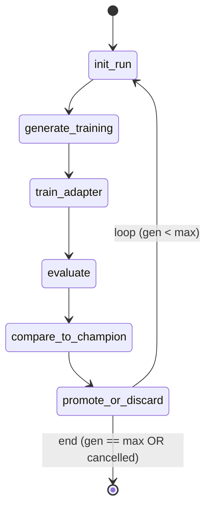

# Evolution Agent

The evolution agent is a [LangGraph](https://langchain-ai.github.io/langgraph/)
state machine that drives the generation → train → evaluate → promote
loop. It lives in [`src/agents/`](../src/agents):

```
src/agents/
├── __init__.py
├── evolution_graph.py     # StateGraph definition (this is the brain)
├── training_backend.py    # MockTrainingBackend + LoRATrainingBackend
├── eval_backend.py        # MockEvalBackend + LMEvalHarnessBackend
└── runner.py              # asyncio task launcher + DB persistence glue
```

## State machine



The `EvolutionState` TypedDict carries everything between nodes:
`run_id`, `generation`, `parent_scores`, `child_scores`, `decision`,
`adapter_path`, `champion_avg`, `cancelled`, `error`. After every node,
`runner._run` calls `LineageDB.update_run_status` so the WebSocket and
REST endpoints reflect live progress.

### Promotion rule

- Generation 1 always promotes (no champion yet).
- Subsequent generations promote iff they beat the champion's average
  by **≥ 0.001** to avoid noise-driven flips.
- Failed generations are persisted with `decision_reason` so the
  lineage page can explain *why* a node was discarded.

## Backends

The graph itself is backend-agnostic. Two matched pairs ship in the
repo:

### `MockTrainingBackend` + `MockEvalBackend` (default on Mac)

- Sleep, then return a deterministic improving curve.
- Match the existing `services.mock_data.mock_score_trends` shape so
  the frontend renders identical charts in dev and prod.
- No GPU, no torch, no Hugging Face.

### `LoRATrainingBackend` + `LMEvalHarnessBackend` (DGX Spark)

- Lazy-import `torch`, `peft`, `trl`, and `lm_eval` only when
  instantiated, so Mac dev images don't need GPU wheels.
- The `_train_sync` and `_evaluate_sync` methods are intentional stubs
  — they *raise* `NotImplementedError` until you wire them to your
  base-model checkpoint, tokeniser, dataset, and accelerator config.
  The mock backends provide the same interface, so the graph is
  exercisable end-to-end without GPU.
- Both real backends offload work to `loop.run_in_executor` so the
  asyncio loop stays responsive (notably for `/api/evolve/{id}/stop`).

### Backend selection

`runner._select_backends` reads `utils.gpu.get_gpu_status()`:
- `gpu_available=True` → instantiate the real backends.
- Instantiation failure (missing wheels, etc.) → fall back to mocks
  with a warning. This keeps the API up even if the GPU pipeline is
  broken — useful for shipping the dashboard before training is wired.

## Cancellation

- `runner.start_evolution` registers the asyncio task in `_TASKS` and a
  bool in `_CANCEL_FLAGS`.
- `POST /api/evolve/{run_id}/stop` calls `runner.request_stop(run_id)`,
  which flips the flag.
- The `on_state_change` callback runs after every node and copies the
  flag onto the graph state. The conditional edge then exits to `END`.

## Persisting state

Every state transition is persisted via `LineageDB`:

| Node                   | DB write                                                     |
| ---------------------- | ------------------------------------------------------------ |
| `init_run`             | `update_run_status(status='running', current_step='init_run')` |
| `train_adapter`        | `update_run_status(current_step='train_adapter')`            |
| `evaluate`             | `update_run_status(current_step='evaluate')`                 |
| `promote_or_discard`   | `save_generation(...)` + `save_score(...)` per benchmark     |
| Final                  | `complete_run(run_id)` (or `update_run_status(status='failed')`) |

Existing REST endpoints (`/api/lineage/tree`, `/api/eval/scores`,
`/api/lineage/activity`) and the WebSocket streams therefore work
unchanged — they just read the rows the agent has been writing.

## Wiring real LoRA training

When you're ready to enable real training on DGX Spark:

1. Implement `LoRATrainingBackend._train_sync(run_id, generation, config)`.
   It should:
   - Load the base model + tokeniser (cached in `hf_cache`).
   - Build the SFT dataset from past champion responses
     (read from Postgres via `LineageDB.get_all_generations`).
   - Train a LoRA adapter with PEFT + TRL's `SFTTrainer`.
   - Save the adapter under `data/adapters/{run_id}/gen-{generation}/`.
   - Return `TrainingResult(adapter_path=..., method='lora', ...)`.

2. Implement `LMEvalHarnessBackend._evaluate_sync(...)`. Wrap
   `lm_eval.simple_evaluate(model='hf-auto', model_args=...)` and return
   the per-benchmark scores.

3. The graph itself does not change.

## Tests

- `tests/test_evolution_graph.py::test_graph_runs_to_max_generations`
  exercises the happy path with both mock backends and asserts the
  promotion pattern (gen 1, 3, 4 promoted; gen 2 discarded).
- `tests/test_evolution_graph.py::test_graph_respects_cancellation`
  asserts the cancel flag exits early without further training.
